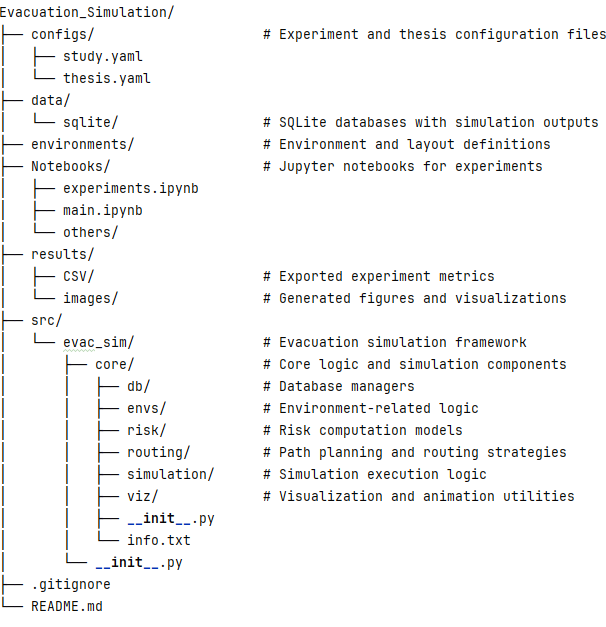

# Evacuation Simulation Framework

Simulation framework for pedestrian evacuation scenarios based on **JuPedSim**, including
risk evaluation, path planning strategies, and interactive visualizations.

This project is developed in the context of academic research on evacuation dynamics
and intelligent environments.

---

## 📌 Project Overview

The goal of this project is to simulate evacuation processes in complex environments,
analyzing different routing strategies and levels of environmental awareness.
The framework allows:

- Agent-based pedestrian simulation using JuPedSim
- Definition of custom environments and walkable areas
- Risk computation per agent and per frame
- Visualization of trajectories and risk evolution
- Storage and analysis of simulation results

A key aspect of the framework is the modeling of different levels of agent
environmental awareness, distinguishing between high-awareness and low-awareness
agents, as well as the comparison of multiple routing strategies.

---

## ✨ Main Features

- Agent-based evacuation simulation
- Multiple routing strategies
- Risk modeling during evacuation
- Interactive animations using Plotly
- SQLite-based storage of simulation data
- Modular and extensible architecture
- Modeling of different levels of agent environmental awareness (high and low)
- Comparison of multiple routing strategies:
  - Efficient routing based on *k-shortest paths*
  - Centrality-based routing strategies (agile routing)

---

## 🗂 Project Structure



The project follows a modular architecture designed to clearly separate responsibilities
across different components of the evacuation simulation framework.

The `core` module contains the fundamental data structures and configuration classes
used throughout the system. Functional modules such as `simulation`, `routing`, and
`risk` implement the main evacuation logic, including agent dynamics, path planning
strategies, and risk evaluation models.

The `envs` module is responsible for environment-related logic and scenario definition,
while `db` handles data persistence and experiment result storage. Visualization and
animation utilities are grouped under the `viz` module.

This structure improves maintainability, extensibility, and reproducibility, enabling
the framework to support systematic experimental analysis.

## ⚙️ Installation

### 1. Clone the repository
```bash
git clone <repository-url>
cd Evacuation_Simulation
```
### 2. Create and activate a virtual environment
```bash
python -m venv .venv

# Windows
.venv\Scripts\activate

# Linux / macOS
source .venv/bin/activate
```
### 3. Install dependencies
```bash
python -m pip install -U pip
python -m pip install -r requirements.txt
```
> ⚠️ **Windows users**  
> JuPedSim requires **Microsoft Visual C++ Redistributable 2015–2022 (x64)** to be installed.

## ▶️ Usage

### Running simulations with Jupyter

Launch Jupyter Notebook from the project root:

```bash
jupyter notebook
```
Open one of the following notebooks:

- `Notebooks/main.ipynb` – main simulation workflow  
- `Notebooks/experiments.ipynb` – execution of experimental scenarios and result analysis  

Run the cells sequentially to configure the environment, execute the simulation,
and visualize the results.

To test different scenarios, it is only necessary to modify the simulation identifier
in the global configuration cell of the notebook.

Specifically, update the value of `simulation_name` with one of the scenario names
defined in `configs/study.yaml`

## ⚙️ Configuration

Simulation parameters and experimental settings are defined using YAML configuration
files located in the `configs/` directory.

Each simulation scenario is identified by a unique name, which can be selected in the
notebooks through the `simulation_name` variable.

If a different configuration file is to be used, it is sufficient to update the
`config_name` variable in the global configuration cell of the notebook, selecting
one of the available YAML files in the `configs/` directory.

## 📊 Results

Simulation outputs are automatically generated to support post-processing and
experimental analysis.

The framework produces the following types of results:

- **SQLite databases** stored in `data/sqlite/`, containing agent trajectories,
  routing information, and per-frame risk values
- **CSV files** exported to `results/CSV/`, providing aggregated metrics suitable
  for statistical analysis
- **Figures** generated during execution, some of which may be saved to
  `results/images/` depending on the experiment configuration

Animations are generated interactively within the Jupyter notebooks for
visual inspection but are not saved to disk by default.

These outputs can be used for quantitative evaluation, comparison of scenarios,
and inclusion in reports or publications.

## 🎥 Simulation Examples

Several representative evacuation scenarios have been simulated to illustrate
the behavior of agents under different routing strategies and levels of
environmental awareness.

In the following videos, agents are divided into two groups for comparison:
- **Left group**: agents following efficient routes based on *k-shortest paths*
- **Right group**: agents following centrality-based routing strategies (agile routing)

Two levels of environmental awareness are considered:

- **Low-awareness scenario**  
  https://vimeo.com/1094342872  
  Agents have limited knowledge of the environment and rely primarily on local
  information when selecting routes.

- **High-awareness scenario**  
  https://vimeo.com/1094342863  
  Agents have broader knowledge of the environment, enabling more informed
  routing decisions.

In both scenarios, the comparison between efficient routing and centrality-based
routing allows qualitative observation of differences in congestion patterns,
route usage, and overall evacuation dynamics.

## 🔁 Reproducibility

All simulation experiments are designed to be reproducible by separating
configuration, execution, and analysis.

- Simulation parameters and scenarios are defined in YAML configuration files
  located in the `configs/` directory
- The execution workflow is fully contained in Jupyter notebooks, which can be
  rerun from start to finish
- Random processes can be controlled through fixed seeds defined in the
  configuration files or notebooks
- Simulation results are stored in structured formats (SQLite and CSV) to enable
  independent post-processing and verification

This setup allows experiments to be reproduced, modified, and extended without
changes to the core simulation code.

## 👤 Author

**Álvaro Serrano**  
Bachelor’s Thesis / Research Project  
Evacuation simulation and intelligent environments
